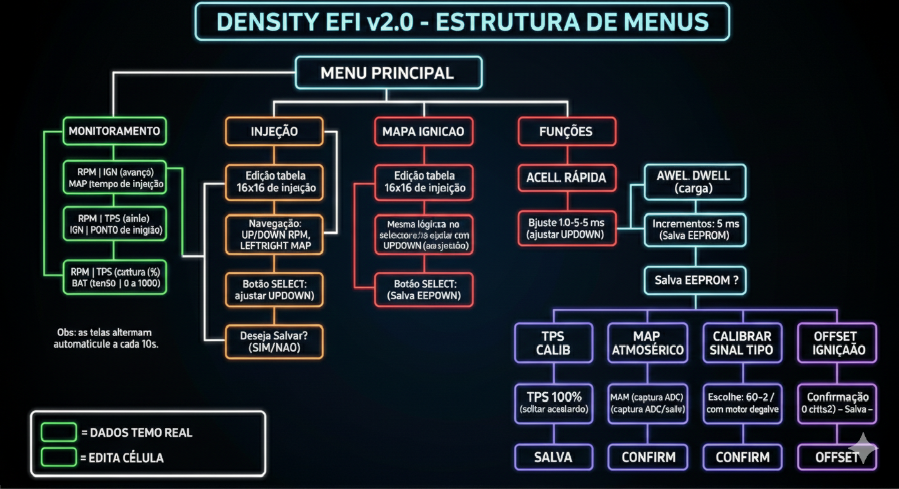
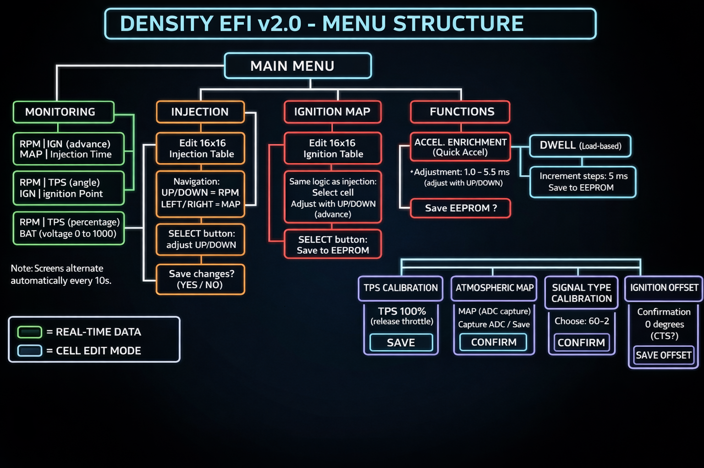

# 🏎️ Density EFI - Engine Management System (v1.1)

[Read in English](#english) | [Ler em Português](#português)

---

## 🇧🇷 Português

O **Density EFI** é um sistema de controle de injeção eletrônica (ECU) de código aberto para a plataforma **Arduino Mega 2560**. Esta versão utiliza uma arquitetura modular para garantir precisão em tempo real e estabilidade no controle do motor, agora com **controle completo de ignição** e funcionalidades avançadas de calibração.

### 🚀 Funcionalidades Atuais
- ⛽ **Injeção de Combustível:** Controle via hardware com precisão de microssegundos, operando em modo *Full Group* ou *Semi-Sequencial*.
- ⚡ **Ignição com Centelha Perdida:** Controle de avanço variável (5° a 40°) e tempo de carga da bobina (dwell) ajustável (1.0 a 5.0 ms). Suporte para sensores 60-2 (reluctor) ou distribuidor.
- 🔄 **Sincronismo Avançado:** Decodificação de sinal de rotação com rastreamento de ângulo do virabrequim (0° a 720°) e detecção automática de dente faltante.
- 📊 **Mapas 16x16 Interativos:** Tabelas de injeção e ignição editáveis diretamente pelo LCD, com navegação simplificada.
- 💾 **Persistência EEPROM:** Armazenamento automático de mapas, calibrações de sensores (TPS, MAP), tipo de sinal, offset de ignição e parâmetros de dwell.
- 🖥️ **Interface HMI:** Menus dinâmicos com três telas de monitoramento rotativas (RPM, MAP, TPS, injeção, avanço, dwell e tensão da bateria) e ajuste fino sem necessidade de PC.
- 🔋 **Monitoramento de Bateria:** Leitura da tensão da bateria via divisor de tensão (pino A5) para diagnóstico.

### 📂 Estrutura Modular
- `Crank.cpp/h`: Gerenciamento de interrupções de rotação, cálculo de RPM e sincronismo para sensores 60-2 ou distribuidor.
- `IgnitionControl.cpp/h`: Controle do avanço de ignição e tempo de carga da bobina (dwell), com modos centelha perdida e distribuidor.
- `Injector.cpp/h`: Escalonador de injeção baseado em posição angular e tempo de abertura, com enriquecimento por aceleração (AE) ajustável.
- `Density_EFI.ino`: Orquestrador principal, leitura de sensores, gerenciamento da interface HMI e integração dos módulos.

### 🗺️ Estrutura de Menus (Atualizada)

---

---

## 🇺🇸 English

**Density EFI** is an open-source engine management system (ECU) for the **Arduino Mega 2560**. This version utilizes a modular architecture to ensure real-time precision and stable engine control, now featuring **complete ignition control** and advanced calibration features.

### 🚀 Current Features
- ⛽ **Fuel Injection:** Hardware-level control with microsecond precision, supporting *Full Group* or *Semi-Sequential* modes.
- ⚡ **Wasted Spark Ignition:** Variable timing advance (5° to 40°) and adjustable coil dwell time (1.0 to 5.0 ms). Supports 60-2 (reluctor) or distributor sensors.
- 🔄 **Advanced Synchronization:** Rotation signal decoding with crank angle tracking (0° to 720°) and automatic missing tooth detection.
- 📊 **Interactive 16x16 Maps:** Full fuel and ignition tables editable directly via the LCD interface, with simplified navigation.
- 💾 **EEPROM Persistence:** Automatic storage of maps, sensor calibrations (TPS, MAP), signal type, ignition offset, and dwell parameters.
- 🖥️ **HMI Interface:** Dynamic menus with three rotating monitoring screens (RPM, MAP, TPS, injection, advance, dwell, and battery voltage) for fine-tuning without a PC.
- 🔋 **Battery Monitoring:** Reads battery voltage via a voltage divider (pin A5) for diagnostic purposes.

### 📂 Modular Structure
- `Crank.cpp/h`: Rotation interrupt management, RPM calculation, and synchronization for 60-2 or distributor sensors.
- `IgnitionControl.cpp/h`: Ignition timing advance and coil dwell control, with wasted spark and distributor modes.
- `Injector.cpp/h`: Injection scheduler based on angular position and pulse width, with adjustable acceleration enrichment (AE).
- `Density_EFI.ino`: Main orchestrator, sensor reading, HMI interface management, and module integration.

### 🗺️ Menu Structure (Updated)

---

---

### 📌 Pinagem de Referência / Pinout (Mega 2560)

| Função / Function | Pino / Pin | Nota / Note |
| :--- | :--- | :--- |
| **RPM Signal** | D21 | Entrada de Interrupção / Interrupt Input |
| **Injector Out** | D22 | Saída p/ Driver MOSFET / MOSFET Driver Output |
| **Ignition Coil A** | D40 | Bobina 1 e 4 (centelha perdida) / Coil 1 & 4 (wasted spark) |
| **Ignition Coil B** | D38 | Bobina 2 e 3 (centelha perdida) / Coil 2 & 3 (wasted spark) |
| **MAP Sensor** | A4 | Entrada Analógica / Analog Input |
| **TPS Sensor** | A3 | Entrada Analógica / Analog Input |
| **Battery Voltage** | A5 | Entrada Analógica (com divisor de tensão) / Analog Input (with voltage divider) |
| **LCD Pins** | 8, 9, 4, 5, 6, 7 | Interface 4-bits |
| **Buttons** | A0 | Escada de Resistores (Keypad) / Resistor ladder (keypad) |

---

### ⚠️ Disclaimer
O ajuste de parâmetros do motor pode resultar em **danos mecânicos graves**. Este projeto tem fins educacionais. Use por sua conta e risco.  
Adjusting engine parameters can result in **serious mechanical damage**. This project is for educational purposes. Use at your own risk.