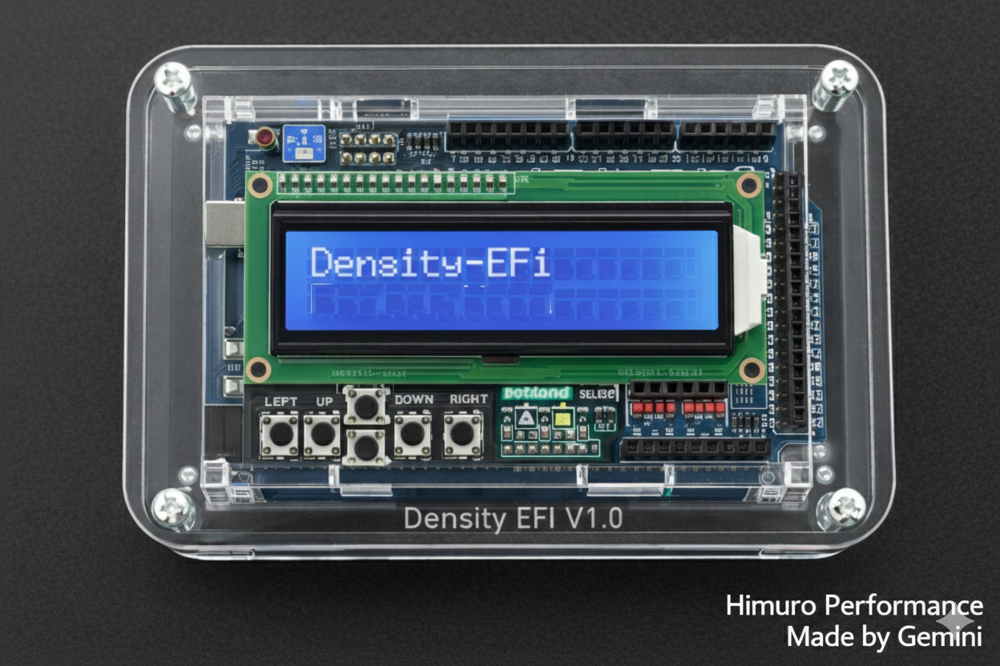

# 🏎️ Density EFI - Engine Management System (v1.1)

[Read in English](#english) | [Ler em Português](#português)

---

### 💻 Layout Hardware Density EFI V1.0 


---
## 🇧🇷 Português

O **Density EFI** é um sistema de controle de injeção e ignição eletrônica de código aberto baseado na plataforma **Arduino Mega 2560**. Projetado para entusiastas e fins educacionais, o sistema utiliza uma arquitetura modular para oferecer precisão em tempo real no gerenciamento de motores a combustão interna.

### 🚀 Funcionalidades Principais

#### ⛽ Injeção Eletrônica
* **Precisão de Hardware:** Controle via **Timer4** (16-bit) com resolução de microssegundos.
* **Mapas Interativos:** Tabela 3D **16x16** (RPM x MAP) editável em tempo real via LCD.
* **Estratégias Avançadas:** Modos *Full Group* e *Semi-Sequencial* com compensação por tensão de bateria.
* **Segurança:** Função *Flood Clear* (corte de combustível com borboleta aberta na partida).

#### ⚡ Ignição Programável
* **Controle de Avanço:** Tabela 16x16 dedicada com avanço variável (5° a 40°).
* **Modos de Operação:** Suporte para **Centelha Perdida** (Wasted Spark) ou **Distribuidor**.
* **Gerenciamento de Dwell:** Tempo de carga configurável (1.0 a 5.0ms) para proteger as bobinas.
* **Sincronismo:** Compatível com roda fônica **60-2** (ajuste de dente de sincronia 0-59) e offset de calibração.

#### 🌡️ Sensoriamento e Atuação
* **Sensores:** MAP (Pressão), TPS (Posição da Borboleta), ECT (Temperatura do Motor) e monitoramento de Voltagem da Bateria.
* **Atuadores:** Controle de eletroventilador automático/manual com histerese e saídas para driver MOSFET de injetores e bobinas.

#### 📊 Interface e Telemetria
* **HMI Dinâmica:** Display LCD 16x2 com 4 telas de monitoramento (RPM, MAP, TPS, Injeção, Avanço, Temperatura).
* **Software Dash:** Telemetria via Serial (115200 baud) compatível com dashboards em Python/Plotly.

---

## 🗺️ Estrutura de Menus (Português)

```mermaid
flowchart TD
    M["🏁 MENU PRINCIPAL"] --> A
    
    subgraph A [MONITORAMENTO]
        direction LR
        T0["📟 Tela 0<br>RPM | IGN<br>MAP | INJ"] --> T1["📟 Tela 1<br>RPM | DWELL<br>IG | PONTO"]
        T1 --> T2["📟 Tela 2<br>RPM | TPS<br>BAT | INJ"]
        T2 --> T3["📟 Tela 3<br>ECT | FAN<br>MODO | SET"]
        T3 -.-> T0
        
        NAV1["◀️ ▶️ Navegação<br>LEFT/RIGHT"] --> T0
    end

    M --> B
    
    subgraph B [MAPA INJEÇÃO]
        BI["⚙️ Edição 16x16<br>Passos: 0.1ms"]
        BN["🔼 RPM<br>◀️▶️ MAP<br>⏺️ SEL Editar"]
        BC["💾 Salvar?<br>SIM / NÃO"]
        BI --> BN --> BC
    end

    M --> C
    
    subgraph C [MAPA IGNIÇÃO]
        CI["⚙️ Edição 16x16<br>Passos: 0.5°"]
        CN["🔼 RPM<br>◀️▶️ MAP<br>⏺️ SEL Editar"]
        CC["💾 Salvar?<br>SIM / NÃO"]
        CI --> CN --> CC
    end

    M --> D
    
    subgraph D [FUNÇÕES]
        direction TB
        FA["⚡ ACEL. RÁPIDA"]
        FA --> FA1["📈 Ganho AE<br>0.0 - 5.0ms"]
        FA1 --> FA2["⏱️ Decaimento<br>50 - 1000ms"]
        
        DW["🔧 DWELL BOBINA"]
        DW --> DW1["⚡ Tempo Carga<br>1.0 - 5.0ms"]
        
        FV["🌀 VENTILADOR"]
        FV --> FV1["🔄 Modo:<br>AUTO / MANUAL"]
        FV1 --> FV2["🌡️ Temp LIGAR<br>50 - 120°C"]
        FV2 --> FV3["🌡️ Temp DESLIGAR<br>45 - 115°C"]
        FV3 --> FV4["✋ Controle Manual"]
    end

    M --> E
    
    subgraph E [CONFIGURAÇÃO]
        direction TB
        CT["📐 CALIBRAR TPS"]
        CT --> CT1["0% (Fechado)"]
        CT1 --> CT2["100% (Aberto)"]
        
        CM["📊 CALIBRAR MAP"]
        CM --> CM1["🌪️ Atmosférico"]
        
        SR["🔄 SINAL ROTAÇÃO"]
        SR --> SR1["60-2 FÔNICA"]
        SR1 --> SR1A["⚙️ Dente Sincro<br>0-59"]
        SR --> SR2["DISTRIBUIDOR"]
        
        OI["🎯 OFFSET IGNIÇÃO"]
        OI --> OI1["-10° a +10°<br>Passos 0.5°"]
    end

    classDef monitor fill:#e1f5fe,stroke:#01579b
    classDef maps fill:#fff3e0,stroke:#e65100
    classDef func fill:#e8f5e8,stroke:#1b5e20
    classDef config fill:#f3e5f5,stroke:#4a148c
    classDef save fill:#ffebee,stroke:#b71c1c
    
    class A,T0,T1,T2,T3,NAV1 monitor
    class B,BI,BN,BC maps
    class C,CI,CN,CC maps
    class D,FA,FA1,FA2,DW,DW1,FV,FV1,FV2,FV3,FV4 func
    class E,CT,CT1,CT2,CM,CM1,SR,SR1,SR1A,SR2,OI,OI1 config
    class BC,CC save
```



---

## 🎮 Comandos de Navegação (HMI)

A interface é operada através de um teclado analógico de 5 botões. O comportamento dos botões muda dinamicamente dependendo do modo atual:

| Botão | Ação | Modo |
|:-----:|------|------|
| **🔼** | Move o cursor para o item anterior / Aumenta valor | Todos os menus |
| **🔽** | Move o cursor para o próximo item / Diminui valor | Todos os menus |
| **⏺️ SELECT** | Entra no menu selecionado / Confirma edição | Todos os menus |
| **◀️** | Alterna telas (sentido anti-horário) / Volta | MONITORAMENTO / Configurações |
| **▶️** | Alterna telas (sentido horário) / Avança | MONITORAMENTO |
| **⏳ Hold (3s)** | Aceleração de incremento | Editando tabelas |

---

## 📋 Detalhamento das Telas de Monitoramento

| Tela | Linha Superior | Linha Inferior | Descrição |
|:----:|----------------|-----------------|-----------|
| **T0** | `R:2500 I:15°` | `M:-0.35 F:3.2ms` | Rotação, Avanço, Pressão, Injeção |
| **T1** | `R:2500 D:3.5ms` | `IG:15° PT:15°` | Rotação, Dwell, Ignição, Ponto |
| **T2** | `R:2500 T:45%` | `V:13.2V F:3.2ms` | Rotação, TPS, Bateria, Injeção |
| **T3** | `ECT:85°C FAN:OFF` | `MODO:AUTO SET:95°` | Temperatura, Ventilador, Config |

---

## ✏️ Modos de Edição

### 1. Edição de Mapas (Injeção e Ignição)
Ao entrar em uma tabela 16x16, utilize os comandos abaixo para calibrar o motor em tempo real:

| Comando | Ação |
|:-------:|------|
| **🔼 / 🔽** | Navega entre as faixas de RPM (Eixo Y) |
| **◀️ / ▶️** | Navega entre as faixas de MAP/Carga (Eixo X) |
| **⏺️ SELECT** | Ativa o modo de edição do valor da célula atual |
| **Hold (Reter)** | Mantendo o botão pressionado, o valor incrementa rapidamente |

### 2. Configuração do Ventilador
O menu do ventilador possui um submenu com 4 etapas:

| Etapa | Função | Ajuste |
|:-----:|--------|--------|
| **1** | Modo | AUTO / MANUAL |
| **2** | Temperatura LIGAR | 50 - 120°C |
| **3** | Temperatura DESLIGAR | 45 - 115°C |
| **4** | Controle Manual | LIGADO / DESLIGADO |

---

## 💾 Fluxo de Salvamento

Para proteger os dados, o sistema utiliza um fluxo de confirmação antes de gravar na memória permanente:

1. Pressione **◀️ (LEFT)** para sair após editar os mapas.
2. O sistema exibirá: **"Deseja Salvar?"**.
3. Selecione **>SIM** para gravar na EEPROM ou **>NÃO** para descartar as alterações daquela sessão.

```
┌─────────────────┐
│  Deseja Salvar? │
│  >SIM     NÃO   │
└─────────────────┘
```

---

## 🎯 Dicas de Uso

* **No MONITORAMENTO**, use **◀️** e **▶️** para alternar entre as 4 telas rapidamente.
* **Nos MAPAS**, pressione **SELECT** sobre o valor desejado e segure **🔼/🔽** para incremento rápido.
* **Sempre confirme** as alterações críticas na tela "ITEM CRITICO!!" para evitar perda de dados.
* **No VENTILADOR**, o modo MANUAL só aparece após desabilitar o AUTO.
* **Calibração MAP** deve ser feita com o motor desligado, chave ligada.

---

## 📂 Estrutura de Arquivos
- `Density_EFI.ino`: Orquestrador principal e lógica de interface.
- `Crank.cpp/h`: Gestão de interrupções, RPM e sincronismo de dentes.
- `IgnitionControl.cpp/h`: Lógica não-bloqueante para avanço e dwell.
- `Injector.cpp/h`: Cálculo de pulse-width e Enriquecimento por Aceleração (AE_tps).
- `DashV1.py`: Interface gráfica Python para telemetria.

---

## 📌 Pinagem de Referência (Mega 2560)

| Função | Pino | Tipo |
|:-------|:-----|:-----|
| **Sinal RPM (Virabrequim)** | D21 | Entrada (Interrupção) |
| **Saída Injetor** | D22 | Saída (Driver MOSFET) |
| **Bobina de Ignição A** | D40 | Cilindros 1-4 |
| **Bobina de Ignição B** | D38 | Cilindros 2-3 |
| **Sensor MAP** | A4 | Analógico (0-5V) |
| **Sensor TPS** | A3 | Analógico (0-5V) |
| **Temperatura do Motor (ECT)** | A1 | Analógico (NTC 10k) |
| **Tensão da Bateria** | A5 | Analógico (Divisor) |
| **Eletroventilador** | D47 | Saída (Relé) |
| **Pinos do LCD** | 8, 9, 4, 5, 6, 7 | Interface 4-bits |

---

### 🔧 Sensores Compatíveis

**Sensor MAP (Pressão):**
- GM/Opel **16137039**
- GM/Opel **33000153**
- GM/Opel **33004212**
- Bosch **F00099P169**

*Estes sensores GM 1-Bar possuem saída linear de 0.5V a 4.5V para pressão de 20kPa a 100kPa, ideais para aplicações aspiradas e turbo leve.*

---

## 🗺️ Menu Structure (English)

```mermaid
flowchart TD
    M["🏁 MAIN MENU"] --> A
    
    subgraph A [MONITORING]
        direction LR
        T0["📟 Screen 0<br>RPM | IGN<br>MAP | INJ"] --> T1["📟 Screen 1<br>RPM | DWELL<br>IG | POINT"]
        T1 --> T2["📟 Screen 2<br>RPM | TPS<br>BAT | INJ"]
        T2 --> T3["📟 Screen 3<br>ECT | FAN<br>MODE | SET"]
        T3 -.-> T0
        
        NAV1["◀️ ▶️ Navigation<br>LEFT/RIGHT"] --> T0
    end

    M --> B
    
    subgraph B [INJ MAP]
        BI["⚙️ 16x16 Edit<br>Steps: 0.1ms"]
        BN["🔼 RPM<br>◀️▶️ MAP<br>⏺️ SEL Edit"]
        BC["💾 Save?<br>YES / NO"]
        BI --> BN --> BC
    end

    M --> C
    
    subgraph C [IGN MAP]
        CI["⚙️ 16x16 Edit<br>Steps: 0.5°"]
        CN["🔼 RPM<br>◀️▶️ MAP<br>⏺️ SEL Edit"]
        CC["💾 Save?<br>YES / NO"]
        CI --> CN --> CC
    end

    M --> D
    
    subgraph D [FUNCTIONS]
        direction TB
        FA["⚡ ACCEL. ENRICHMENT"]
        FA --> FA1["📈 AE GAIN<br>0.0 - 5.0ms"]
        FA1 --> FA2["⏱️ DECAY TIME<br>50 - 1000ms"]
        
        DW["🔧 COIL DWELL"]
        DW --> DW1["⚡ Charge Time<br>1.0 - 5.0ms"]
        
        FV["🌀 COOLING FAN"]
        FV --> FV1["🔄 Mode:<br>AUTO / MANUAL"]
        FV1 --> FV2["🌡️ Temp ON<br>50 - 120°C"]
        FV2 --> FV3["🌡️ Temp OFF<br>45 - 115°C"]
        FV3 --> FV4["✋ Manual Control"]
    end

    M --> E
    
    subgraph E [CONFIGURATION]
        direction TB
        CT["📐 CALIBRATE TPS"]
        CT --> CT1["0% (Closed)"]
        CT1 --> CT2["100% (Open)"]
        
        CM["📊 CALIBRATE MAP"]
        CM --> CM1["🌪️ Atmospheric"]
        
        SR["🔄 RPM SIGNAL"]
        SR --> SR1["60-2 RELUCTOR"]
        SR1 --> SR1A["⚙️ Sync Tooth<br>0-59"]
        SR --> SR2["DISTRIBUTOR"]
        
        OI["🎯 IGNITION OFFSET"]
        OI --> OI1["-10° to +10°<br>Steps 0.5°"]
    end

    classDef monitor fill:#e1f5fe,stroke:#01579b
    classDef maps fill:#fff3e0,stroke:#e65100
    classDef func fill:#e8f5e8,stroke:#1b5e20
    classDef config fill:#f3e5f5,stroke:#4a148c
    classDef save fill:#ffebee,stroke:#b71c1c
    
    class A,T0,T1,T2,T3,NAV1 monitor
    class B,BI,BN,BC maps
    class C,CI,CN,CC maps
    class D,FA,FA1,FA2,DW,DW1,FV,FV1,FV2,FV3,FV4 func
    class E,CT,CT1,CT2,CM,CM1,SR,SR1,SR1A,SR2,OI,OI1 config
    class BC,CC save
```



---

## 🎮 Navigation Commands (HMI)

The interface is operated through a 5-button analog keypad. Button behavior changes dynamically depending on the current mode:

| Button | Action | Mode |
|:------:|--------|------|
| **🔼** | Move cursor up / Increase value | All menus |
| **🔽** | Move cursor down / Decrease value | All menus |
| **⏺️ SELECT** | Enter selected menu / Confirm edit | All menus |
| **◀️** | Switch screens (counter-clockwise) / Back | MONITORING / Configuration |
| **▶️** | Switch screens (clockwise) / Next | MONITORING |
| **⏳ Hold (3s)** | Acceleration increment | Table editing |

---

## 📋 Monitoring Screens Detail

| Screen | Top Line | Bottom Line | Description |
|:------:|----------|-------------|-------------|
| **T0** | `R:2500 I:15°` | `M:-0.35 F:3.2ms` | RPM, Advance, Pressure, Injection |
| **T1** | `R:2500 D:3.5ms` | `IG:15° PT:15°` | RPM, Dwell, Ignition, Point |
| **T2** | `R:2500 T:45%` | `V:13.2V F:3.2ms` | RPM, TPS, Battery, Injection |
| **T3** | `ECT:85°C FAN:OFF` | `MODE:AUTO SET:95°` | Temperature, Fan, Config |

---

## ✏️ Edit Modes

### 1. Map Editing (Injection and Ignition)
When entering a 16x16 table, use the commands below to calibrate the engine in real-time:

| Command | Action |
|:-------:|--------|
| **🔼 / 🔽** | Navigate between RPM ranges (Y-axis) |
| **◀️ / ▶️** | Navigate between MAP/Load ranges (X-axis) |
| **⏺️ SELECT** | Activate edit mode for current cell value |
| **Hold** | Press and hold for rapid increment |

### 2. Fan Configuration
The fan menu has a submenu with 4 steps:

| Step | Function | Range |
|:----:|----------|-------|
| **1** | Mode | AUTO / MANUAL |
| **2** | Temperature ON | 50 - 120°C |
| **3** | Temperature OFF | 45 - 115°C |
| **4** | Manual Control | ON / OFF |

---

## 💾 Save Flow

To protect data, the system uses a confirmation flow before writing to permanent memory:

1. Press **◀️ (LEFT)** to exit after editing maps.
2. The system will display: **"Save?"**.
3. Select **>YES** to write to EEPROM or **>NO** to discard changes from that session.

```
┌─────────────────┐
│    Save?        │
│  >YES     NO    │
└─────────────────┘
```

---

## 🎯 Usage Tips

* **In MONITORING**, use **◀️** and **▶️** to quickly switch between the 4 screens.
* **In MAPS**, press **SELECT** on the desired value and hold **🔼/🔽** for fast increment.
* **Always confirm** critical changes on the "CRITICAL ITEM!!" screen to avoid data loss.
* **In FAN**, MANUAL mode only appears after disabling AUTO.
* **MAP calibration** should be done with the engine off, key on.

---

## 📂 File Structure
- `Density_EFI.ino`: Main orchestrator and interface logic.
- `Crank.cpp/h`: Interrupt management, RPM and tooth synchronization.
- `IgnitionControl.cpp/h`: Non-blocking logic for advance and dwell.
- `Injector.cpp/h`: Pulse-width calculation and Acceleration Enrichment (AE_tps).
- `DashV1.py`: Python graphical interface for telemetry.

---

## 📌 Pinagem de Referência / Pinout (Mega 2560)

| Função / Function | Pino / Pin | Tipo / Type |
|:-------------------|:-----------|:------------|
| **RPM Signal (Crank)** | D21 | Input (Interrupt) |
| **Injector Out** | D22 | Output (MOSFET Driver) |
| **Ignition Coil A** | D40 | Cylinders 1-4 |
| **Ignition Coil B** | D38 | Cylinders 2-3 |
| **MAP Sensor** | A4 | Analog (0-5V) |
| **TPS Sensor** | A3 | Analog (0-5V) |
| **ECT (Temp)** | A1 | Analog (NTC 10k) |
| **Battery Voltage** | A5 | Analog (Divider) |
| **Cooling Fan** | D47 | Output (Relay) |
| **LCD Pins** | 8, 9, 4, 5, 6, 7 | 4-bit Interface |

---

### 🔧 Compatible Sensors

**MAP Sensor:**
- GM/Opel **16137039**
- GM/Opel **33000153**
- GM/Opel **33004212**
- Bosch **F00099P169**

*These GM 1-Bar sensors feature linear output from 0.5V to 4.5V for pressure ranging from 20kPa to 100kPa, ideal for naturally aspirated and light turbo applications.*

---

## ⚠️ Disclaimer
O ajuste de parâmetros do motor pode resultar em **danos mecânicos graves**. Este projeto tem fins educacionais. Use por sua conta e risco.  
Adjusting engine parameters can result in **serious mechanical damage**. This project is for educational purposes. Use at your own risk.